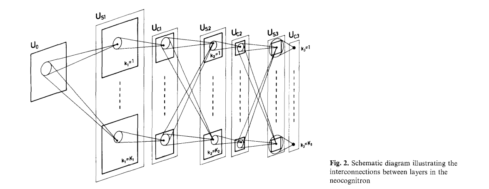
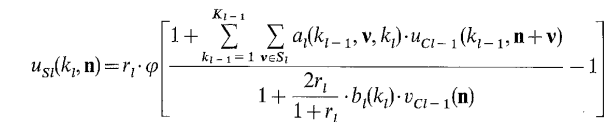
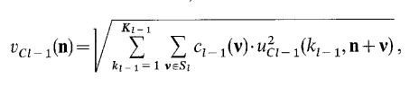
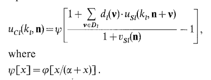
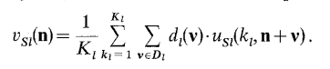
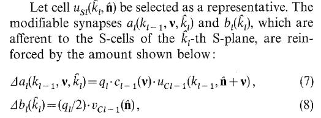
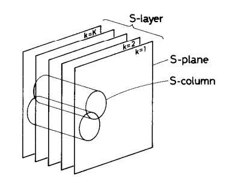
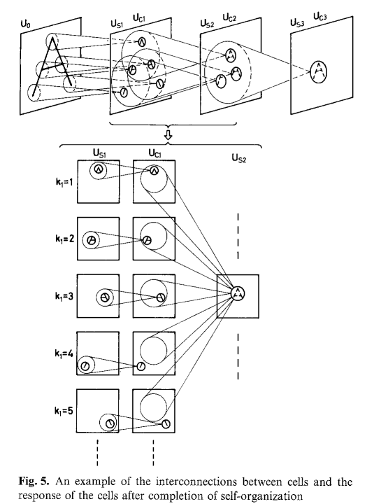

# NEOCOGNITRON

**A Self-organizing Neural Network Model for a Mechanism of Pattern Recognition Unaffected by Shift in Position**

- Inspired from **pattern recognition** of brain
- Introduces the concept of pattern recognition without being affected by the position of the actual object.
- Introduces hierarchical learning for pattern recognition (simple corner,edges --> complex corners and textures --> actual shapes)

## Architecture

where, 

- **Uo** : input layer (input => matrices)
- **S cell**: 
    - Simple cells or lower order hypercomplex cells according to the classification of Hubel and Wiesel. 
    - We call it S-layer and denote the S-layer in the l-th module as Usl.
- **C cell**:
    - Complex cells or higher order hypercomplex cells. 
    - We call it C-layer and denote the C-layer in the l-th module as Ucl.

- **Vertical** tetragons ==> S/C layer
- Enclosed tetragons ==> S/C plane

**Notations**

- **Usl(kl,n)** to represent the output of an S-cell in the kl-th S-plane in the l-th module
- **Ucl(kl, n)** to represent the output of a C-cell in the kl-th C-plane in that module

where n is the two dimensional co-ordinates representing the position of these cell's receptive fields in the input layer.

- Deeper the layer ==> Larger is the receptive field
- As receptive field increases ==> Density of planes decreases ==> Number of cells per plane decreases
- In last module, the receptive field of each C-cell becomes so large as to cover the whole area of input layer Uo, and each C-plane is so determined as to have only one C-cell.

- Both S and C cells are excitatory cells ==> Output of each cell is supposed to increase the activity of the next cells they connect to.
- In contrast, model also has inhibitory cells: **VSl(n)** and **VCl(n)** which serve to regulate/reduce activity

- All cells ==> analog type i.e. input and output take non-negative analog values proportional to pulse density (instantaneous mean frequency --> how frequently a neuron fires)

**S cells** have shunting type inhibitory inputs.
- Output of an S cell in kl-th S plane in the l-th module  is described as

where Q(x) is just **ReLU**

- When l=1, UCl(kl-1, n) ==> Uo(n) and Kl-1 = 1

- **al(kl-1,v,kl)** ==> efficiency of excitatory synapses
- **bl(kl)** ==> efficiency of inhibitory synapses

**S cells in the same plane have identical input synapses**, hence above *al*, *bl* do not contain arguement representing the position *n* of the receptive field of cell USl(kl, n)

- **rl** in formula ==> how strongly inhibitory inputs affect the response of S-cells (feature-detecting cells),
    - Thus higher the value, stronger the suppression ==> making output selective (it will only respond when its preferred feature is present very clearly, and will ignore weaker or less precise matches.)
    - **WHY?**
        - High selectivity means response to selective patterns, helping distinguish between similar patterns
        - Low selectivity means response to broader range of inputs (distorted, noisy versions), helping to tolerate distortions
    - **Trade-Off**
        - *rl* too high ==> network becomes picky and fails to recognize patterns that are slightly noisy
        - *rl* too low ==> network becomes too tolerant, cannot distinguish similar patterns

**Inhibitory cell VCl-1(n)** has inhibitory synaptic connections to **S cells** has an RMS style input to output type charactersitic

where,

- Cl-1(v) ==> efficiency of unmodifiable excitatory synapses, set to monotonically decreasing function *|v|*

- These cells important for network to make reasonable evaluation of similarity

From output of S cell and V cell, the area from which a single cell recieves input (i.e summation range Sl of v) is identical for both ==> basically defines the receptive field for the layer

- *l=1* ==> summation range small ==> smaller receptive field
- as *l* increases ==> summantion range increases ==> larger receptive field

    - **WHY?**
        - Small summation in first layer ==> Early layers focus on detecting simple features, local features
        - Larger summation in later layer ==> Later layers integrate info from larger portions of image, allowing to detect more complex/global features.

**S cells achieves **TRANSLATIONAL INVARIANCE**, a key disadvantage of traditional MLPs**
- **How**: In each S-plane, network organizes itself so there are many S-cells of same type (focus on same feature), but each one looks at different part of image (receptive field positions are different)
- Thus when translation occurs, original S cell misses the feature, but another S cell in same plane captures it

**S to C layer connection**
- fixed connections, do not change with further learning
- Each C cell ==> respond strongly if atleast one of it's connected S-cells is highly active ==> ensures position invariance as C cell will activate as long as feature is somewhere in it's input field

**C-cell**

- Shunting type inhibitory inputs similar to S-cells
- But outputs show saturation characteristic

Output of C-cell in kl-th C-plane in the l-th module is given by 

Inhibitory cell *Vsl(n)* sends inhibitory signals to this C cell ==> responsible for lateral inhibition (suppress unnessecary responses in surrounding cells) and yields output proportional to weighted mean of inputs

- From output of C-cell and Vs cell, the efficiency of unmodifiable excitatory synapse *dl(v)* is set to be a monotonically decreasing function *|v|*. Thus dl(v) repsresnts strength of connection of S-cell to C-cell depending on spatial offset v
    - Strength decreases as distance |v| increases, S-cells closer to centre of C-cell's receptive field contribute more strongly

- Connecting Area *Dl* is the reigon of S-cells that connect to a particular C-cell, first layer Dl small, deeper layer, Dl grows larger enabling complex feature detection

- Parameter *alpha* ==> positive constant, controls degree of saturation for C-cells
    - Low alpha ==> C-cells saturate faster (reach max output quickly), thus less sensitive to increase in input
    - High alpha ==> C-cells stay in linear response regime longer, thus more sensitive to increase in input

## Self-Organization of the Network

- Occurs each time a stimulus (pattern) is presented

- From each S-layer, a small group of **representative S-cells** (those with larger outputs) are selected, only 1 per plane and representatives are chosen from S-columns (groups of S-cells at same input location but across planes)

- Input synapses (modifiable connections) to each represenatative S-cell, and all S-cells in same plane, are strengthened(reinforced) by specific amounts determined by their previous activity and defined by

- Synapses in S-cell without representatives are not reinforced

- Initially, excitatory synapses (*al(kl-1, vl, kl)*) have small +ve values ==> S-cells can detect orientations, but weakly at first
    - Preferred orientation for each S-cell is different depending on it's S-plane (i.e., different groups are tuned to different directions), but these initial settings follow a formula and are not random.
- Initially, inhibitory synapses (*bl(kl)*) are set to 0

### Representative Selection Procedure

- First, In an S-layer, we watch a group of S-cells whose receptive fields are situated within a small area on the input layer

- **S-columns and S-planes**: In each S-layer, S-cells are grouped into "S-columns." Each S-column contains S-cells from all S-planes (each S-plane detects a different feature), but all have receptive fields at nearly the same position in the input.
- Overlapping Columns: S-columns overlap, so a single S-cell can belong to multiple S-columns.

- **Selecting Candidates**: When a stimulus pattern is presented, in each S-column, the S-cell with the largest output is chosen as a candidate for being a "representative."
    - This means several candidates may be chosen from the same S-plane (since S-columns overlap).

- **Final Representative**: For each S-plane, if multiple candidates exist, only the one with the largest output is chosen as the representative for that S-plane.
    - If only one candidate exists in an S-plane, it is chosen as the representative.
    - If no candidate exists in an S-plane, no representative is chosen from that S-plane for this pattern.

**Why this matters?**

- This process ensures that each S-plane (feature type) becomes specialized for a different feature in the input patterns.
- It prevents redundancy: two S-planes won't end up detecting the same feature.
- Only a few S-planes are reinforced for each pattern; others will be reinforced by other patterns, promoting diversity in feature detection.

## Network Working

- After training (“self-organization”), the neocognitron forms many feature-extracting cells—each becomes sensitive to specific parts or shapes (like A, B, C, etc.).

- The network works as follows:
    - Lower layers (near input): Each S-plane detects simple features (e.g., “A-shape”, “line-end”).
    - C-cells: Respond whenever their input group of S-cells detects a feature, making their responses tolerant to small position shifts.
    - Higher layers: S-cells integrate inputs from several C-planes, detecting more complex combinations of features and their relative positions.
    - Final layer: A dedicated C-cell strongly responds only if the entire pattern (like “A”) is present, regardless of where it appears in the input.

- Many cell-planes are shared for feature extraction across multiple patterns, so the number of required planes does not increase rapidly with more patterns. (**Crucial as one of MLP's downside was PARAMETER EXPLOSION**)

- Pattern recognition happens in stages: Each stage matches input features in small visual fields, increasing both the receptive field and tolerance to shifts/distortions at higher stages.

- In the end, the neocognitron can reliably recognize learned patterns, even if they are shifted or distorted, due to the hierarchical and piecewise comparisons performed in the network.

## TO SUMMARIZE: S-Layer ==> CONVOLUTION LAYER and C-Layer ==> POOLING LAYER

## COMPUTER SIMULATION

**1.** Network Architecture
- 7 layers
- Three pairs of S-layer (feature extraction) and C-layer (pooling): US1 -> UC1 -> US2 -> UC2 ->  US3 -> UC3
- Cell-planes: Each layer (except input) has 24 cell-planes (think: feature maps in CNNs).
- Cell Counts:
    - U0 : 16 x 16 (input grid)
    - US1: 16 x 16 x 24
    - UC1: 10 x 10 x 24
    - US2: 8 x 8 x 24
    - UC2: 6 x 6 x 24
    - US3: 2 x 2 x 24
    - UC3: 24 (one cell per plane)

**2.** Connectivity and Parameters
- S-layer receptive field:  Each S-cell connects to a 5×5 region in the previous layer.
- C-layer receptive field: Each C-cell connects to a 5×5 region (or 2×2 in the last layer).
- S-column: For S-layers, an S-column contains 5×5×24 cells (or 2×2×24 in the last S-layer).
- Parameters:
    - Inhibitory efficacy: r1=4.0 , r2 = r3 = 1.5
    - Excitatory Synapse Normalization: sum(cl-1(v)) = 1
    - Reinforcement speed: q1 = 1, q2 = q3 = 16
    - Saturation c = 0.5

**3. Self Organization and Learning**
- Unsupervised learning: Patterns ("0", "1", "2", "3", "4") are presented repeatedly (20 times each), with random shifts in position.
- Feature extraction: After training, each pattern activates only one C-cell in the final layer UC3 and each C-cell responds only to its specific pattern.
- Robustness: Recognition is unaffected by position, shape distortion, or noise.
- Scalability: With more patterns (up to 10), the network can still learn to recognize them if parameters and presentation are well-tuned. More cell-planes may be needed for larger pattern sets.

