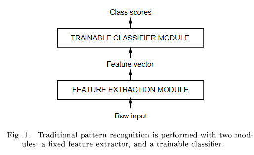
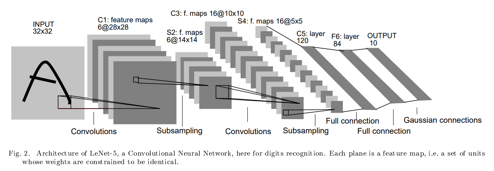
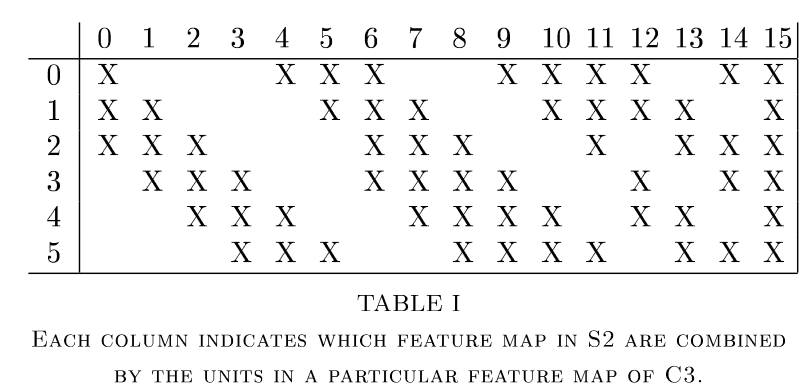
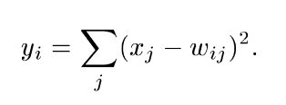
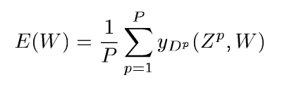
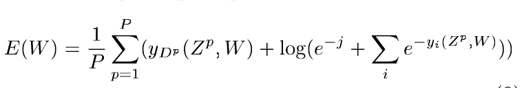

# LeNet-5

## Traditional Approach:

System divided into 2 modules

- Feature Extractor: 
    - transforms input images to low dimensional vectors
    - specific to task and often entirely handcrafted
- Classifier:
    - general purpose and trainable

Limitation:

- Accuracy depends on the ability of designer to come up with apt. set of features (must be redone for each new problem)

Thus , CNN

## Convolutional Networks - Theory and Mapping to LeNet

Convolutional Networks force the extraction of local features by restricting the receptive fields of hidden units to be local.

CNN combine 3 architectural ideas to ensure some degree of shift, scale and distortion invariance

- **Local Receptive Fields**
- **Shared Weights (weight-replication)**
- **Spatial/Temporal Subsampling**

- Input: images, size normalized and centred
- Each unit in a layer: recieves input from a set of units loaded in a small neighborhood in previous layer

Local Receptive Fields => neurons extract elementary visual features such as oriented edges, endpoints, corners etc

These are then combined by subsequent layers in order to detect higher order features

Elementary feature detectors that are useful on one part of the image are likely to be useful across the entire image. This knowledge can be applied by forcing a set of units, whose receptive fields are located at different places on the image to have identical feature vectors

Units in a layer are organized in **planes** within which all units share same set of weights. 

Set of outputs of the units in such a plane is called **FEATURE MAPS**

Units in  a feature map are constrained to perform same operation on different parts of the image

* A complete convolutional layer is composed of several feature maps (with diff. weight vectors) so that multiple features can be extracted at same location

In the image above,

- Units in first hidden layer are organized in 6 planes, each of which is a feature map.
- A unit in feature map has 25 inputs connected to a 5x5 area in input called as **RECEPTIVE FIELD**
- Each unit has 25 inputs and thus 25 trainable coefficients plus a trainable bias

The receptive fields of contigous (side by side) units in a feature map are centred on correspondingly contigous units in previous layer, thus receptive fields of neighbouring units overlap (to not miss any useful info)

All units in a feature map have same set of 25 weights and bias so they detect same feature at all possible locations of the input

For LeNet:

- At each input location, 6 different types of features are extracted by 6 units in identical locations in the 6 feature maps

- A sequential implementation of a feature map would scan the input image with a single unit that has a local recptive field and stores the states of this unit at corresponding locations in the feature maps

Above operation ==> Equivalent to **CONVOLUTION**, this is followed by an additive bias and *Squashing* function

Hence the name convolutional network

**Kernel** of convolution is the set of connection weights used by units in feature maps

NOTE: If input image shifted, output feature map will be shifted by same amount

Thus,

Once a feature has been detected, its exact location becomes less important, only its approx position relative to other features is relevant

A simple way to reduce the precision with which position of distinctive features are encoded in a feature map is to reduce the spatial resolution of feature map

Achieved using **sub-sampling layers** which performs local averaging and subsampling, thereby reducing the resolution of feature map and reducing sensitivity of output to shifts and distortions

For LeNet:

- Second hidden layer is *sub-sampling* layer
- Comprises of 6 feature maps (one for each feature maps in previous layer)
- Receptive field of each unit is a 2x2 area in previous layer's corresponding feature map

- Thus each unit computes the average of its 4 inputs, multiplies it with trainable cofficient and adds a trainable bias and passes the result through sigmoid function

- Contigous units have non overlapping contigous receptive fields. Consequently a subsampling layer feature map has half the rows and columns as feature map in previous layer. 

- The trainable coefficient and bias control the effect of SIGMOID non-linearity
    - If coeff. small => unit operates in a quasi-linear (almost but not exactly linear) mode and subsampling layer merely blurs the input
    - If coeff. large => subsampling units can be seen as performing a "Noisy OR" or "Noisy AND" operation depending on value of bias

Successive Layers of convolution and subsampling are typically alternated. At each layer,
- Number of feature maps is increased as the spatial resolution is decreased

This Convolution and Subsampling convolution inspired by S-cells and C-cells in <a href="01_neocognitron-1980.md">Neocognitron</a>

A large degree of invariance to geometric transformations of the input can be achieved with this progressive reduction of spatial resolution compensated by a progressive increase in the richness of representation (no. of feature maps)

- Since all weights learned via backpropagation, convolutional networks can be seen as synthesizing their own feature extractor
- The weight sharing technique reduces the number of parameters

## LeNet - 5 

- 7 layers (excluding input)
- Input: 32 x 32 pixel image
- Normalized so that background white corresponds to value of -0.1 and foreground black corresponds to a value of 1.175, This makes mean input ~ 0 and variance ~ 1 which accelerates learning

Cx - Convolutional Layers

Sx - Subsampling Layers

Fx - Fully Connected Layers

- **Layer C1**
    - 6 feature maps
    - Each unit in each feature map connected to a 5x5 neighborhood in input (Filter size = 5x5)
    - Size of feature maps is 28x28 
    - No Padding
    - 156 trainable parameters
    - 122,304 connections

- **Layer S2**
    - 6 feature maps
    - Each unit in each feature map connected to a 2x2 neighborhood in corresponding feature map in C1 (Filter size = 2x2)
    - Size of feature maps is 14x14
    - 4 inputs are added, multiplied by trainable coeff. and added to a trainable bias. Result passed through sigmoidal function
    - Non overlapping receptive fields (therefore spatial dimensions halved)
    - 12 trainable parameters
    - 5880 connections

- **Layer C3**
    - 16 feature maps
    - Each unit in each feature map connected to a several 5x5 neighborhoods at identical locations in subset of S2's feature maps 
    - Size of each feature map is 10x10
    - Why not connect every S2 feature map to every C3 feature map?
        - Keeps the number of connections in reasonable bound
        - Forces a break of symmetry in network => Different feature maps are forced to extract different (hopefully complementary) features because they get different set of inputs
    - Rationale behind connection scheme:
        - First 6 C3 feature maps take inputs from every contigous subsets of 3 feature maps in S2
        - Next 6 take input from every contigous subset of 4
        - Next 3 take input from some discontinous segments of 4
        - Last 1 takes input from all S2 feature maps
    - 1516 trainable parameters
    - 151,600 connections

- **Layer S4**
    - 16 feature maps
    - Each unit in each feature map is connected to a 2x2 neighborhood in corresponding feature map in C3
    - Size of each feature map is 5x5
    - 32 trainable parameters
    - 2000 connections

- **Layer C5**
    - 120 feature maps
    - Each unit is connected to a 5x5 neighborhood on all 16 of S4's feature maps
    - Since size of S4 is also 5x5, Size of C5's feature maps is 1x1
    - Amounts to full connection between S4 and C5
    - 48,120 trainable connections

- **Layer F6**
    - 84 units (reason below)
    - Fully connected to C5
    - 10,164 trainable parameters

Note:

    - For all layers, weighted sum + bias is calculated, denoted by a_i for unit i
    - This a_i passed through a squashing function to produce the state of unit i, denoted by x_i 
        
        x_i = f(a_i)

        The squashing function is a scaled hyperbolic tangent

            f(a) = A tanh(Sa)

            - A is amplitude of function (constant, chosen to be 1.7159)
            - S determines slope at origin

- **Output Layer**
    - Composed of Euclidean Radial Basis Function (RBF)
    - One for each class, with 84 inputs each
    - Outputs of ach RBF unit y_i is computed

    

    - Each RBF unit computes the Euclidean distance between input vector and it's parameter vector
    - Output can be interpreted as penalty term measuring fit between input pattern and a model of class associated with RBF
    - In Probabilistic terms, RBF output can be interpreted as unnormalized negative log likelihood of a Gaussian distribution in the space configurations of layer F6
    - Thus, given an input pattern, the loss function should be designed so as to get the configuration of F6 as close as possible to the parameter vector of RBF (distributed codes) that corresponds to pattern's desired class
    - Components of these parameter vectors were chosen by hand (initially) and kept fixed, set to 1 or -1
        - Designed to represent a stylized image of corresponding character class drawn on 7x12 bitmap (thus 84)
            - This not particularly useful for recognizing isolated digits, but quite useful for recognizing strings of characters taken from full printable ASCII set
        - Rationale: 
            - Characters that are similar and thus confusable (such as O, o, 0) will have similar output codes
            - This is useful if  combined with linguistic post processer that can correct such confusion
    - Reason for using *distributed codes*:
        - What is distributed code?
            - Output is *code word* in high dimensional space. Each class corresponds to one code word, So instead of `one neuron => one class` , we have `one pattern = one class` 
            - 1 of N code: one-hot encoding, `one neuron 1, rest 0 => one class`
            - So in LeNet, each class represented by a vector (12x7) filled with 1 and -1.
        - Non Distributed codes => perform poorly as number of classes increases (Reason: output units in these cases must be off most of the time, this is hard to achieve with sigmoid)
        - Classifiers are trained not only to recognize characters, but also to reject non-characters => RBF with distributed codes are more apt. for this purpose because unlike sigmoid, they are activated within a well circumscribed region of their input space that non typical patterns are most likely to fall outside of

        - Thus the parameter vectors of the RBFs play role of *target* vectors for layer F6
            - Values +1, -1 are within range of sigmoid, (they are points of maximum curvature of sigmoids => F6 units operate in maximally non linear range), So saturation is prevented (saturation leads to slow convergence and ill conditioning of loss function)

- **Loss Function**
    
    - simplest option: Max Likelihood Estimation criteria 
    - Equivalent to MSE for our case

    

    - yDp is output of the Dp-th RBF unit (i.e one that corresponds to correct class of input patter Zp)

    - 3 Limitations
        - If we allow parameters of RBF to adapt, E(W) has trivial but unacceptable solution
            - All RBF parameter vectors are equal and state of F6 is constant and equal to that of parameter vectors (So parameter vectors u1,u2,...un = u and F6 = u). So each RBF output becomes 0
            - Mathematically Correct, In reality, network completely ignored input, same output for all inputs => No actual classification
            - *WHY does this happen?*
                - MSE only rewards bringing correct RBF distance to 0, it doesn't penalize making all distances 0, so network can cheat by collapsing everything to same vector
            - This can be avoided if RBF parameter vectors are kept fixed (not trainable)
        - No competition between classes
            - Plain MSE => nothing forcing the network to make wrong class outputs worse while improving correct one
                - So we only minimize distance for correct class's RBF, other RBFs can do anything, no *PENALTY* if they become small
    
    - To overcome => discriminative training criteria

    

    - Here, in addition to pushing down penalty for correct class like MSE, it also pulls up penalty for incorrect classes

**Training Config**
- 20 iterations
- Global learning rate:
    - 0.0005 for first 2 passes
    - 0.0002 for next 3 passes
    - 0.0001 for next 3 passes
    - 0.00005 for next 4 passes
    - 0.00001 thereafter
- u was set to 0.02