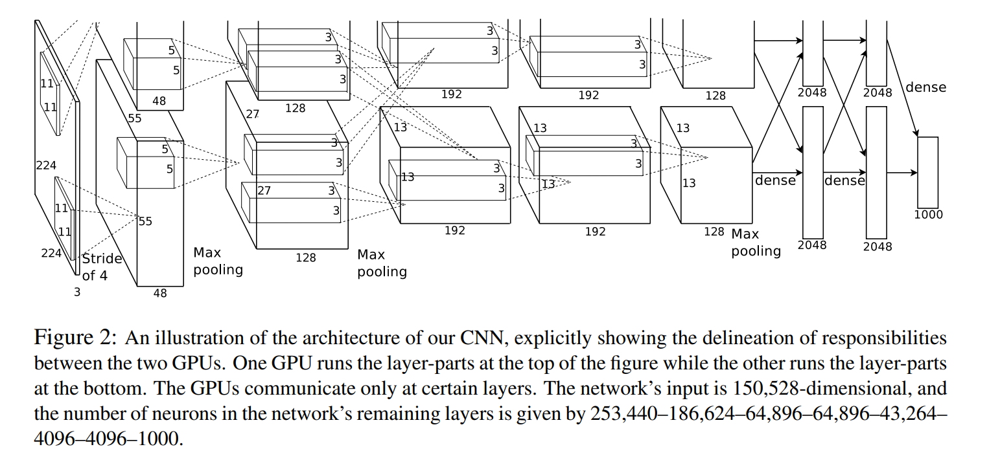

# AlexNet

- 5 convolutional layers
- 3 fully connected layers
- Optimal depth, removing any layer leads to *inferior* performance

- ImageNet
    - top-1 error rate
    - top-5 error rate: Fraction of test images for which the correct label is not among the five labels considered most probable by the model.
    - downsampled to 256 x 256
    - No other preprocessing

## Architecture

### ReLU Non-Linearity

- TanH and Sigmoid are saturating non-linearities (at extremely high values, the gradient improvement is minimal, thereby constraining learning), also comparitively slower training times as compared to non-saturating non-linearities like **ReLU**

- Faster learning has a great influence on the performance of large models trained on large datasets.

### Local Response Normalization

- ReLU do not require input normalization to prevent them from saturating (if atleast some training examples produce a positive input  to a ReLU, learning will happen in that neuron), However Local Normalization still aids generalization.

- Introduced as a way to encourage competition between nearby feature maps (i.e. channels) at same spatial location

Let $a_{x,y}^i$ be the activity of neuron computed by applying kernel $i$ at position ${(x, y)}$ and then applying ReLU non-linearity, the response-normalized activity $b_{x,y}^i$ is given by

$$
b_{x,y}^i = a_{x,y}^i / (k + \alpha \sum_{j=max(0, i-n/2)}^{min(N-1, i+n/2)} (a_{x,y}^j)^2)^\beta
$$

where sum runs over n "adjacent" kernel maps at same spatial position and N is total number of kernels in the layer

- Denominator normalizes based on the energy (squared activations) of neighboring channels

- Ordering of kernel maps is arbitrary and determined before training begins
    - Design Choice to compete with neighbors only
- This normalization implements a form of *lateral inhibtion* inspired by the type found in real neurons, creating competition for big activities amongst neuron outputs computed using different kernels. 

- Lateral Inhibition: Channels that produce large activations suppress the responses of neighboring channels, encourages diversity in learned filters because
    - If one filter fires very strongly on a pattern, neighborly filters firing weakly get suppressed even more, So only the strongest channel stays prominent
    - This helps ReLU by reducing co-adaptation, that is filters cannot all respond strongly to the same feature, each filter has to specialize more

- Constants determined using validation set $k=2, n=5, \alpha = 10^-4 , \beta = 0.75$

- Results in reduction in top-1 and top-5 error rates by 1.4% and 1.2%.

### Overlapping Pooling

- Summarize outputs of neighboring groups of neurons in same kernel map
- Traditionally do not overlap
- Precisely stating,
    - Pooling layer can be visualized as grid of pooling units where
        - Each pooling unit
            - looks at square neighborhood of size z x z
            - is positioned s pixels away from next pooling unit (stride = s)
            - summarizes the neighborhood using max, avg, etc.
        - 2 important units
            - z = size of each pooling window
            - s = stride
    
    - Case 1: s == z
        - Common form of pooling, Eg. max-pooling with 2x2 window with stride 2
        - Each window touches the next one without overlapping.
        - This produces non-overlapping pooling.
    - Case 2: s < z
        - Stride is smaller than window size
        - Eg. max-pooling with 3x3 window with stride 2
        - The next pooling window starts before the previous one ends.
        - So, pooling regions overlap, some input pixels contribute to multiple pooling units
        - The network retains slightly more spatial information
        - This produces overlapping pooling used in AlexNet

- In case of AlexNet, s=2 & z=3 was used instead of s=2 & z=2
    - Resulted in reduction in the top-1 and top-5 error rates by 0.4% and 0.3%
    - Slightly more difficult to overfit

### Complete Architecture

- 8 layers with weights
- First 5 are convolutional 
- Remaining 3 are fully connected
- Output of last fully connected layer is fed to a 1000 way softmax which produces a distribution over 1000 class labels.

- Network maximizes **multinomial logistic regression (softmax cross-entropy)** objective ==> maximizing the average across training cases of the log probability of the correct label under precition distribution
    - Goal of training
        - For each training example, model outputs a probability distribution over all possible labels
        - Objective is to assign highest probability to correct label
        - network adjusts its weights to maximize the log-probability of the true label

    - Why log probability
        - It turns products of probabilities into sums, which is easier to optimize.
        - It heavily penalizes confident but wrong predictions.
    
    - What is meant by "maximize the average across all training cases" mean?
        - For each training sample,
            - Compute the log of predicted probability of correct class
            - Average this across all training samples
            - Optimization process tries to make this average as large as possible
        - Equivalently, minimzing the negative of this quantity => standard cross-entropy loss

- Kernels in the 2nd, 4th and 5th conv. layers are connected only to those kernel maps in the previous layer which reside on the same GPU
- Kernels of 3rd conv layer  are connected to all kernel maps in the second layer.
- The neurons in the fullyconnected layers are connected to all neurons in the previous layer.
- Response-normalization layers follow the 1st and 2nd conv. layers. 
- Max-pooling layers follow both response-normalization layers as well as the 5th conv. layer.
- The ReLU non-linearity is applied to the output of every convolutional and fully-connected layer.

- First Conv. Layer filters 224 x 224 x 3 input image with 96 kernels of size 11 x 11 x 3 with stride of 4 
- Second Conv. Layer takes as input the (LRN and pooled) output of First Conv. layer and filters it with 256 filters of size 5 x 5 x 48.
- Third Conv. Layer has 384 kernels of size 3 x 3 x 256 to the (normalized, pooled) outputs of Second Conv. Layer
- Fourth Conv. layer has 384 kernels of size 3 x 3 x 192
- Fifth Conv. layer has 256 kernels of size 3 x 3 x 192
- Third, Fourth, Fifth Conv. layers are connected to another without any intervening pooling or normalization layers
- Fully Connected Layers have 4096 neurons each.

## Reducing Overfitting

- Overall model has 60 million parameters, To avoid overfitting, 2 primary ways used

### Data Augmentation

- Generating image translations and horizontal reflections, 224 x 224 patches (and their horizontal reflections) from 256 x 256 images extracted and network trained on these patches
    - Increases training set by factor of 2048, but allows to use deeper models, otherwise severe overfitiing.
    - At test time, network made a prediction by extracting FIVE 224 x 224 patches (4 corner and 1 centre) as well as their horizontal reflections, so effectively **TEN** patches and *AVERAGING* predictions made by network's softmax layer on 10 patches
- Altering intensities of RGB channels in training images
    - Specificically, PCA performed on set of RGB pixel values throughout ImageNet training set.
    - To each training image, we add multiples of found principal components with magnitudes proportional to the corresponding eigenvalues times a random variable drawn from a Gaussian with mean zero and standard deviation 0.1
    - Thus to each RGB image pixel $I_{xy} = [I_{xy}^R , I_{xy}^G , I_{xy}^B]^T$, we add the quantity $[p_1, p_2, p_3][\alpha_1 \lambda_1 , \alpha_2 \lambda_2 , \alpha_3 \lambda_3]^T$ where $p_i$ and $\lambda_i$ are the i-th eigenvector and eigenvalue of the 3 x 3 covariance matrix of RGB pixel values, respectively and $\alpha_i$ is the aforementioned random variable.
    - Each $\alpha_i$ is drawn only once for all pixels of particular training image until that image is used for training again, at which point it is redrawn
    - This makes it invariant to changes in intensity and color of illumination
    - Reduces top 1 error by over 1%

### Dropout
- Consists of setting to zero the output of each hidden neuron with probability 0.5
- These dropped out neurons do not contribute  to forward pass or the backpropagation
- So for an input sample, network samples a different architecture but all architectures share same weights
- This technique reduces co-adaptations of neurons, forcing robust learning for each neuron
- At test time, we use all neurons but multiply outputs by 0.5 which is reasonable approx. to  taking the geometric mean of the predictive distributions produced by the exponentially-many dropout networks.

## Learning Details

- Batch Size = 128
- Stochastice Gradient Descent
- Momentum = 0.9
- Weight Decay of 0.0005

- Weights of each layer were initialized from a Zero-Mean Gaussian distribution with std. dev. 0.01
- Biases in 2nd, 4th and 5th layers as well as in all fully connected layers with constant 1
- Biases in remaining initialized to 0
- This initialization accelerates the early stages of learning by providing the ReLUs with positive inputs.

- Equal Learning Rate used for all layers, manually adjusted throughout training
    - Heuristic: Divide LR by 10 when validation error rate stopped improving
    - LR initialized to 0.01
    - While training in their case (3 times updated)

## Results

- top1 error: 37.5% (prev SOTA: 47%)
- top5 error: 17% (prev SOTA: 28.2%)

- Averaging predictions of ensemble of 5 similar CNN => 16.4%
- One CNN with extra 6th Conv layer => 16.6%

- Current depth crucial, removing any leads to increase in error rate by over 2%