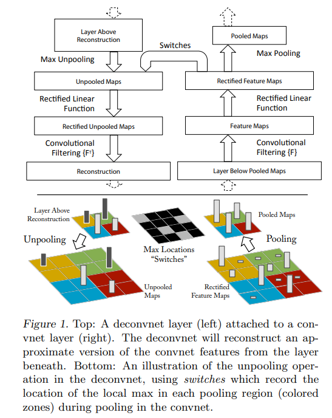
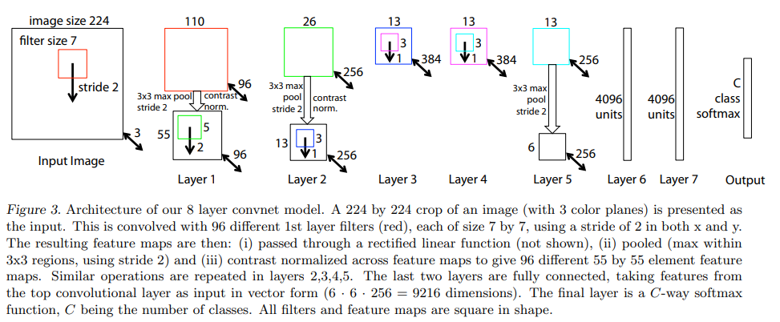

# ZF-Net :  Visualizing and Understanding Convolutional Networks

Goal: Understanding **WHY** Large Conv Nets perform so well.

Visualization Technique Proposed: Multi-Layered Deconvolutional Network

## DeConvNet
- A ConvNet model that uses same components (filtering, pooling) but in **REVERSE**
- Thus, instead of mapping pixels to the features, we do the opposite
- Originally defined as a way to perform unsupervised learning.

- To examine a ConvNet:
	- A DeConvNet is attached to each of its layers, providing a continuous path back to the image pixels
	- Input Image ⇒ ConvNet ⇒ Features computed throughout the layers
	- Set all other activations in layer to 0 and pass feature maps as input to attached deconvnet layer
	- Feature Maps ⇒ DeConvNet ⇒ UnPool ⇒ Rectify ⇒ Filter to reconstruct activity in the layer beneath that gave rise tot he chosen activation
	- This is repeated till input pixel space is reached

### UnPooling

- ConvNet, max-pooling operation is **NON-INVERTIBLE**
- Approximate Inverse possible by recording the locations of maxima within each pooling region in a set of switch variables
- Unpooling uses these switches to place the reconstructions from layer above into appropriate locations preserving structure of stimulus

### Rectification

- ConvNet, ReLU non-linearities, rectify the feature maps thus ensuring feature maps are always positive
- Need valid reconstructions? ⇒ Pass the reconstructed signal through ReLU non-linearity

### Filtering

- ConvNet, uses learned filters to *convolve* feature maps from previous layer
- So to invert this, DeConvNet uses transposed versions of same filters, but applied to the rectified maps, not the output of the layer beneath
- In practice, this means ⇒ Flipping each layer vertically and horizontally

Projecting Down from higher layers uses the switch generated by max pooling on the way up,  As these switch settings are peculiar to given input image, the reconstruction obtained from single activation thus resembles a small piece of original input image with structures weighted according toe heir contribution toward the feature activation.

## Training

- AlexNet used but sparse connections in layers 3,4,5 (due to model split to 2 GPUs) replaced by dense connections.
- Resize to 256 x 256
- Subtract per-pixel mean (across all images) and then using 10 different sub-crops of size 224 x 224 (corners + center with and without horizontal flips)
- SGD with Mini-Batch size of 128
- Initial LR = 0.01
- Momentum = 0.9
- Annealing of LR on plateau
- Dropouts used (layer 6 and 7) with p=0.5
- All weights initialized to 0.01 and all biases initialized to 0
-  70 epochs

### Observations

- Visualization of first layer filters during training show that few of them dominate, To combat this, we **RENORMALIZE** each filet in conv layers whose RMS exceeds a fixed radius of 0.1 to this fixed radius
- Important in first layer as images are in range [-128, 128]

### Feature Visualizations

- Layer 2 corresponds to corners and other edge/color conjunctions
- Layer 3 has complex invariances capturing similar textures
- Layer 4 shows significant variation but is more class-specific
- Layer 5 shows entire objects with significant pose variation

### Feature Evolutions

- For each feature map, the visualization shows the **region in the input image that most strongly activates it** — that is, which part of some image triggers the highest response for that filter.
- During training, as network weights change, **the image that produces the highest activation for a feature might change**.
-   **Lower layers**  (closer to the input) learn  **simple features**  like edges, colors, or textures. These converge quickly — often after just a few epochs — because these patterns appear everywhere in images.
-   **Upper layers**  (closer to the output) learn  **complex, abstract features**  like object parts or category-specific patterns. These evolve slowly, requiring many epochs (40–50 in this example) to stabilize and specialize.

### Feature Invariance

- **Lower layers** (closer to the input) reacts strongly to even small transformations. A slight shift, rotation, or rescaling changes pixel arrangements, and since early filters detect low-level patterns (edges, colors, textures), their activations change dramatically.
- **Higher layers** (closer to the output) which represent abstract features (like “object type” or “face presence”), are much **more stable** — especially for translation and scaling. The representation changes **quasi-linearly**, meaning its variation follows a roughly predictable, small, smooth curve as the input is moved or scaled. 
- The model is **not generally invariant to rotation** unless image is rotationally symmetric

### Architecture Selection

- Visualizing trained model ⇒ insight into its ops and also *assists* in selecting good architectures in the first place

- Eg. AlexNet, visualizing first and second layers, various problems are apparent
	- First layer filters are mix of extremely high and low frequency info with little coverage of mid frequencies
	- Second Layer shows aliasing artifacts caused by large stride 4 used in 1st conv. 
	- To remedy this,
		- reduce 1st layer filter size from 11x11 to 7x7
		- made the stride of convolutions to 2 instead of 4
	- This has shown to improve performance.

### Occlusion Sensitivity
- Is the model truly identifying the location of the object in the image or just using the surrounding context?
- So, systematically occlude different portions of input with a grey square and monitoring output
- Results show, probability of correct classification drops significantly when object is occluded, otherwise stable
- The  **activity curve**  (sum of activations over spatial positions) is plotted against occluder position. When the occluder covers the key image region that aligns with this activation, the feature map’s activity **drops dramatically**.

## Experiments

### Varying Model Sizes

- Removing the fully connected layers ⇒ only slight increase in error (surprising considering they contain majority of model parameters)
- Removing 2 of middle conv layers also make relatively small difference to error rates
- Removing both 2 of middle and fully connected layers' performance is drastically worse, Shows overall depth of the model is important (also proven in AlexNet)
- Changing size of fully connected layers ⇒ little to no difference
- Increasing size of middle convs ⇒ useful gain in performance
- Increasing both, size of middle conv and fully connected layers ⇒ Overfitting