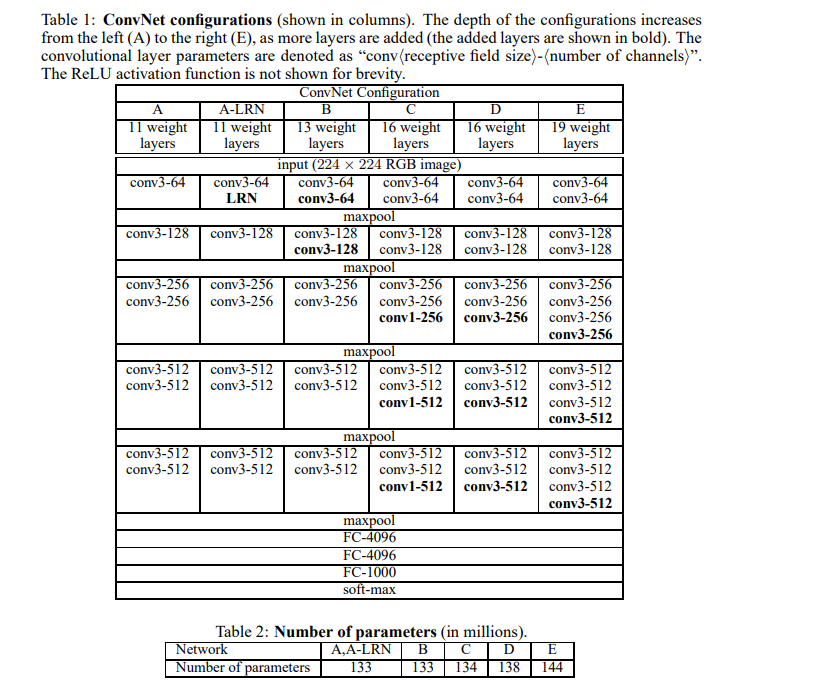
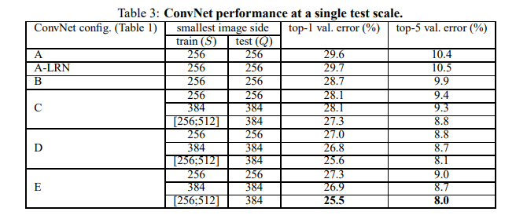
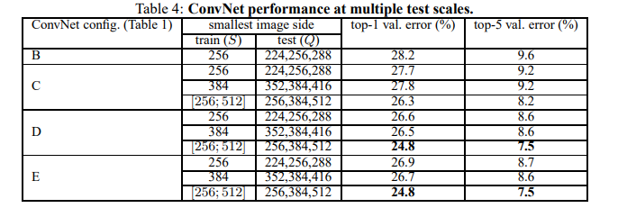
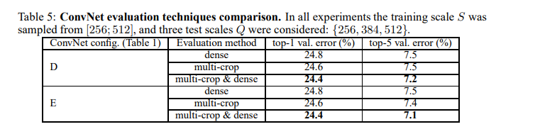

# VGG-Net

Several attempts made to improve accuracy using the AlexNet model, few ways include

- Smaller receptive windwow size and smaller stride for the first convolutional network
- Training and Testing the network densely over the whole image and over multiple scales

This paper ==> **DEPTH**
- Keep other parameters same, and steadily increase depth of the network by adding more convolutional layers which is feasible due to the use of very small $3 \times 3$ convolutional filters in all layers.

## Architecture

**Input:** Fixed size $224 \times 224$ RGB image.

**Preprocessing:** Normalization(Mean)

**Conv-Nets Stack:** 

- $3 \times 3$ filters used consistently, with $1 \times 1$ also being used in some places, followed by non-linearity
- Stride is kept fixed at **1**
- Padding used to preserve spatial size i.e. padding is **1** for $3 \times 3$ conv layers
- Max Pooling used (not after every conv-layer), Size $2 \times 2$ with stride = 2

**Fully Connected Layers:** 3 Fully Connected layers, first two have 4096 channels, final has 1000 (num classes in ImageNet), followed by SoftMax

**Non Linearity:** ReLU

> Local Response Normalization (not used) as opposed to AlexNet as it was proven via empirical testing, that LRN don't improve performance, but leads to increased memory consumption and computation time.

## Configurations

6 different neural nets trained, depth varying from 11 layers (8 conv, 3 F.C.) in A to 19 layers in E.

Width of conv layers (number of channels) is rather small, starting from 64 in first layer and then increasing by factor of 2 after each max-pooling till we reach 512

Inspite of large depth, number of weights in our nets is not greater than number of weights in a more shallow net with larger conv. layer widths and receptive fields.

### Why $3 \times 3$

Why use $3 \times 3$ throughout the whole network?

- Easy to see ==> Stack of 2 $3 \times 3$ conv layers (without pooling in b/w) ==> effective receptive field size of 5
- Similarly ==> Stack of 3 $3 \times 3$ conv. layers (without pooling in b/w) ==> effective receptive field size of 7

So what have we gained by using stack of 3 $3 \times 3$ conv. layers instead of using a single $7 \times 7$?

- 3 Non-Linear ReLU layers instead of just 1 ==> Makes the decision function more **discriminative**
- Number of parameters decreased

Illustration

Assume both input and output of a 3 layer $3 \times 3$ conv stack has C channels, the stack is parameterized by $3 (3^2 C^2) = 27 C^2$ weights

While $7 \times 7$ layer would require ==> $7^2C^2 = 49C^2$ parameters

**81% more**

Incorporation of $1 \times 1$ conv. layers is a way to increase the non-linearity of decision function without affecting the receptive fields of the conv. layers

Even though in our case, $1 \times 1$ convolution is essentially a linear projection onto space of same dimensionality (number of input and output channels are same), an additional non-linearity is introduced by ReLU

## Training

**Training objective:** Multinomial Logistic Regression Objective or Cross-Entropy

**Batch and Optimization:** Mini-Batch Gradient Descent Algorithm with momentum, batch size is 256, momentum is 0.9

**Regularization:** Weight Decay (L2 multiplier) set to $ 5 x 10^-4$, Dropout set with p=0.5 (only after first 2 fully connected)

**Learning Rate and Schedule:** Initially set to 0.01, decreased by factor of 10 when validation didn't improve

Despite greater depth, VGGNet required less epochs to converge because

- Implicit regularization imposed by greater depth and smaller conv. filter sizes
- Pre-initialization of certain layers.

**Initialization**

Bad Initialization can stall learning due to instability of gradients in deep nets.

Config A: shallow enough to train with random initialization.

When training deeper nets,

- First 4 conv. layers and 3 fully connected layers, initialized with layers of network A
- Intermediate initialized randomly with normal distribution $\mathcal {N} (0, 0.01)$
- No need to decrease L.R. for pre-initialized layers.
- Biases initialized to 0

After submission, found layers can be initialized without pretraining using **Xavier initialization**

**Input Transforms:**

- Random Cropping from rescaled training images
- Random horizontal flipping
- random RGB color shift

### Training Image Size

Let S be the smallest side of an isotropically rescaled training image

2 approaches for setting S

- S = 256 and S = 384
    - First train network on S=256
    - Initialize network with params from (S=256), and retrain using S=384 (LR here is 0.001)

- Randomly sample S from certain range [256, 512] ==> equivalent to train set augmentation by scale jittering.

## Testing

First, rescaling done to predefined smalles image side ==> Q

Note Q not nessecarily equal to S

Then Network applied in the following way, the fully connected layers are converted to convolutional layers
- First FC ==> $7 \times 7$ layer
- Last 2 FC ==> $1 \times 1$ layers

Result: Class Score Map with number of channels equal to the number of classes

Finally to obtain a fixed size vector of class scores for the image, the class-score map is spatially averaged (sum-pooled)

Test Set augmented by horiontal flipping of images, softmax posterior of the original and flopped images are averaged to get the final score

Since, fully convolutional network is applied to the full image, there is no need to sample multiple crops at test time (less-efficient, since it needs network recomputation for each crop)

Mult-Crop evaluation is complimentary to dense evaluation ==> different convolution boundary conditions

## Evaluation

### Single Scale

$Q = S$ for fixed S

$Q = 0.5 (S_min + S_max)$ for jittered $S \isin [S_min, S_max]$

LRN applied to network A ==> not better than network A without LRN, thus not applied forward

Classification Error decreases with Network Depth

Inspite of same depth, Network C (has 3 $1 \times 1$ layers) performs worse than Network D ==> Indicated that while adding non-linearit helps (C > B), it is also important to capture spatial context by using con-filters with non-trivial receptive fields (D > C)

Scale jittering at trainning ($S \isin [256, 512]$) leads to significantly better results than training on image wit hfixed S=256, or S=384.

### Multi Scale 

Effect of scale jittering at test time.

Basically running a model over several rescaled version of the images, followed by averaging the resulting class posteriors

Fixed S ==> Q = { S - 32, S, S + 32}

Variable S ($S \isin [S_min, S_max]$) ==> Q = { $S_min$, $0.5(S_min + S_max)$, $S_max$}

Result: Scale Jittering at test time leads to better performance

### Multi-Crop Evaluation

Multiple Crops perform slightly better than dense evaluation

But they are complementary, as combination outperforms

### Conv-Net Fusion

Combine Outputs of several models by averaging their soft-max class posteriors

Ensemble of all ==> 7.3

Ensemble of D and E ==> 7

Ensemble of D and E with multicrop and dense eval ==> 6.8

## Conclusion

Representation Depth ==> Beneficial for Classification Accuracy

VGGNet also generalizes well to other datasets