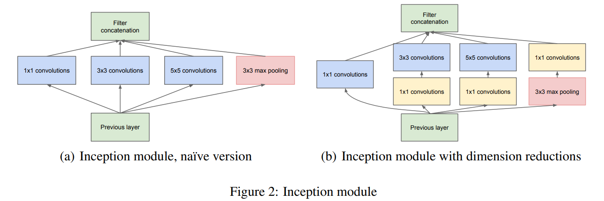
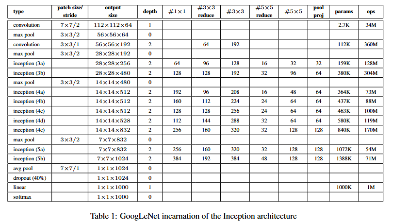

# GoogLeNet - Going Deeper with Convolutions.

> 12x fewer parameters in comparison to AlexNet

> Fixed Computational Budget for all experimentation: 1.5 billion multipy-adds at inference

We need to go "Deeper"?

- New level of organization in the form of "Inception Module"
- Increased Network Depth

## Related Work

Since LeNet-5: CNN ==> stacked convolutional layers (optionally followed by pooling and normalization), and finally fully connected layers.

Recent efforts have been to increase number of layers and layer size while using Dropout to avoid overfitting.

Theoretically, Max Pooling: loss of accurate spatial information

Despite this, the standard architectures has worked well for all vision related tasks.

An inspiration was taken from neuroscience model of primate visual cortex to use a series of fixed "Gabor filters" of different sizes in order to handle multiple scales.

> Read more about <a href="extras/googlenet/gabor-filter.md">Gabor Filter and it's relevance here</a>

$1 \times 1$ convolutional layers used heavily

- Used for dimensionality reduction to remove computational bottlenecks ==> Allows for not increasing depth & width of network.

## Motivation

Standard way of improving performance in deep networks: **increase size:**

- depth (number of levels)
- width (number of units at a level)

Easy and safe way of training higher quality model, But **2 drawbacks:**

- Bigger Size ==> Larger number of parameters ==> Prone to overfitting.
- Increased use of computational resources. Eg. if 2 conv layers are chained, any uniform increase in the number of their results ==> quadratic increase of computation.

**Solution:**

Move away from *fully connected layers* to *sparsely connected architectures* even inside the convolutions.

- Works because: If the probability distribution of the dataset is representable by a large, very sparse deep neural network, then the optimal network topology can be constructed layer by layer by analyzing the correlation statistics of activations of last layer and clustering neurons with highly correlated outputs.
- Resonates with Hebbian principle: **Neurons that fire together, wire together**

> Undestand this in more detail <a href="extras/googlenet/motivation.md">here</a>

**Disadvantage:**

Computing infrastructures are very inefficient when it comes to numerical calculation on non-uniform sparse data structures.

Even if number of arithmetic operations is reduced by 100x, the overhead for lookups and cache misses is so dominant that switching to sparse ==> **not worth it**

This gap widened further by **libraries tuned for dense matrix calculation** 

Also, most current vision oriented ML system utilize sparsity in spatial domain just by the virtue of employing convolutions. However convolutions are implemented as collections of dense connections to the patches in the earlier layer.

Traditionally ConvNets have used random and sparse connection tables in feature dimensions in order to break symmetry and improve learning, but moved back to fully connected to utilize parallel compute.

The uniformity of the structure and a large number of filters and greater batch size allow for utilizing efficient dense computation.

**What next?**

Is there any hope: **An architecture that makes use of the extra sparsity, even at filter level, as suggested by the theory, but exploits our  current hardware by utilizing computations on dense matrices?**

Literature suggests  that clustering sparse matrices into relatively dense submatrices tends to give state of the art practical performance for sparse matrix multiplication.

**Inception**



Started out as a case-study for assessing the hypothetical output of a sophisticated network topology construction algorithm that tries to approximate a sparse structure for vision networks and covering the hypothesized outcome by dense, readily available components.

Although proposed architecture has become a success for computer vision, it is still questionable whether its quality can be attributed to the guiding principles that have lead to its construction.

The most convincing proof would be if an automated system would create network topologies resulting in similar gains in other domains using the same algorithm but with very differently looking global architecture.

<a href="extras/googlenet/how-and-why-inception.md">Read More</a>

## Architecture

Main Idea: **Find out how an optimal local sparse structure in a convnet can be approximated and covered by readily available dense components**

This basically means:
- The ideal network is sparse and irregular
- Hardware cannot execute that efficiently
- So we approximate it using blocks of dense computation

> Assuming translational invariance ==> Network built using Convolutional building block.

**So we need to find optimal local construction and to repeat it spatially.**

```
Local does not only mean Spatial

Local means:
- local in feature space
- local in scale
- local in correlation structure

We are searching for: a small graph motif that mirrors how image features depend on each other.

This motif: INCEPTION
```

### First Idea: Correlation Driven Clustering

Layer by Layer construction in which, one should analyze the correlation statistics of last layer and cluster them into groups of units with high correlation. 

```
Assumption here: correlated activations --> shared latent cause --> should be grouped together
```

These clusters form the units of the next layer and are connected to the units of previous layer.

We assume  that each unit from the earlier layer corresponds to some region of the input image and these units are grouped into filter banks.

In the lower layers (the ones close to the input) correlated units would concentrate in local regions. This means, we would end up with a lot of clusters concentrated in a single region and they can be covered by a layer of $1 \times 1$ convolutions in the next layer.

```
Why 1 X 1?

Early layers:
- features are spatially localized
- correlations are mostly within the same pixel location
- cross-channel correlations dominate

So clustering yields:
- channel-wise grouping
- no need to look spatially outward

A 1 X 1 convolution does exactly this
- same spatial position
- learned mixing across channels
- zero spatial aggregation
```

However, we can also expect that there will be a smaller number of more spatially spread out clusters that can be covered by convolutions over larger patches and there will be a decreasing number of patches over larger and larger regions.

```
Higher layers:
- features represent larger image structures
- correlations spread spatially
- fewer such structures exist

Thus
- fewer clusters
- larger receptive fields
- increasing reliance on 3×3 and 5×5

This is a prediction and not a tuning rule
```

To avoid patch alignment issues, Inception architecture restricted to filter sizes $1 \times 1$, $3 \times 3$ and  $5 \times 5$, more so cause of convenience than necessity.

```
Engineering convenience, odd sized kernels preserve center alignment, even kernels introduce phase ambiguity
```

Output filter banks concatenated into a single output vector forming the input of next stage.

Alternative pooling paths in each such stage would have beneficial effect.

```
Pooling Paths: Why they belong

Pooling:
- destroys spatial phase
- increases local invariance
- highlights presence over exact location

Including pooling in parallel means:
- invariance is optional, not enforced
- the network decides where invariance helps

This avoids prematurely discarding spatial detail.
```

These inception modules stacked over one other, their output correlation statistics are bound to vary: as features of higher abstraction are captured by higher layers, their spatial concentration is expected to decrease suggesting that the ratio of 3×3 and 5×5 convolutions should increase as we move to higher layers.

Big problem: Even a modest number of $5 \times 5$ convolutions can be prohibitively expensive on top of a convolutional layer with large number of filters. This problem becomes more pronounced once pooling units are added: The merging of the output of the pooling layer with the outputs of convolutional layers would lead to an inevitable increase in the number of outputs from stage to stage. Even while this architecture might cover the optimal sparse structure, it would do it very inefficiently, leading to a computational blow up within a few stages.

```
A 5 X 5 cost scales with input channels × output channels, concatenation increases channel count, pooling adds yet another stream

So each stage increases dimensionality, memory and compute

Leads to inevitable computational blowup

Example:

Suppose stage n outputs 192 channels
- A modest 5×5 conv with 32 output filters costs ~192 × 32 × 25 = 153,600 ops per spatial position. 
- Concatenating four paths (say, 64 + 128 + 32 + 192 from pooling) yields 416 channels for stage n+1.
- The next 5×5 conv then costs ~416 × 32 × 25 = 333,120 ops—already doubled—repeating per stage.

Pooling preserves channels (output channels = input channels), so its stream adds the full prior C_out to the concat, forcing relentless channel growth. No dimension reduction means each stage's input balloons, quadratically hiking conv costs downstream.

After 3–4 stages, channels might hit 1000+, with 5×5 costs per position exceeding millions of ops, plus memory explosion from feature maps (H × W × C).
```

### Second Idea: Dimension Reduction

Judiciously applying dimension reduction and projections wherever the computational requirements would increase too much.

```
- sparsity should exist between clusters
- density should exist within clusters
- but dimensionality must be controlled
```

Basis: Success of Embeddings

Even low dimensional embeddings  might contain a lot of information about a relatively large image patch. However, embeddings represent information in a dense, compressed form and compressed information is harder to model

```
Info can be compressed, and redundancy exists, so representations can be dense.

But "Compressed info harder to model"
- embeddings hide structure
- they entangle factors of variation
- they are costly to process further

Thus compression must be
- local
- temporary
- strategically placed
```

We would like to keep our representations sparse at most places and compress signals only whenever they have to be aggregated.

i.e. $1 \times 1$ convolutions are used to compute reductions before the expensive $3 \times 3$ and $5 \times 5$ convolutions.

Besides being used as reductions, they also include the use of rectified linear activation which makes them dual-purpose.

```
Role 1X1 convolutions

- Projection/Reduction
    - lower channel dimensionality
    - reduce cost of expensive convolutions
- Non-Linear Re-encoding
    - ReLU introduces sparsity (obvious)
    - Re-Seperates mixed signals

Thus 1 X 1 convs are not passive reducers, They are active re-parameterizations.
```

```
Note: Visual info is temporarily lost during projection but is eventually recovered

- 1 X 1 convs don't discard spatial dimensions but channel-wise info is mixed/compressed

So channel wise detail lost, finegrained seperation between features and some disentangled factors of variation

Recovery happens automatically through the parallel Inception branches: the 3×3 and 5×5 conv paths capture refined spatial hierarchies and disentangle factors using reduced channels from their own 1×1 projections, while the pooling branch adds invariance.
```

An Inception network is a network consisting of modules of the above type stacked upon each other, with occasional max-pooling layers with stride 2 to halve the resolution of the grid.

For technical reasons (memory efficiency during training), it seemed beneficial to start using Inception modules only at higher layers while keeping the lower layers in traditional convolutional fashion.

```
Why?

Early layers
- feature maps are large
- spatial resolution dominates memory
- multi-branch would explode memory

But also,
- early features are simple
- benefit less from scale diversity

So traditional convs suffice early.
```

### Key Benefits

- **Scale without blowup**
    -  increase width
    - explore multiple scales
    - without quadratic compute growth
- **Shielding via Projection**
    - Large kernels never see:
        - full channel space
        - raw high-dimensional features
    - This prevents overfitting and compute waste.
- **Simultaneous multi-scale abstraction**
    -  Aligns with the intuition that visual information should be processed at various scales and then aggregated so that the next stage can abstract features from different scales simultaneously.
- **Graceful degradation**
    - Allows for to create slightly inferior, but computationally cheaper versions of it. 

### Summary

- Theory demands sparsity
- Vision demands multi-scale processing
- Hardware demands dense computation
- Engineering demands control of dimensionality

**Inception is the intersection of all four.**

## GoogLeNet

> Name given to pay homage to LeNet-5



All conv-layers use ReLU as non-linear activations.

Input to network: $224 \times 224$ RGB colors, with mean subtraction.

The #$3 \times 3$ reduce & #$5 \times 5$ reduce: Number of $1 \times 1$ filters in the reduction layer used before $3 \times 3$ and $5 \times 5$ convolutions.

All $1 \times 1$ reduction/projection layers also use ReLU.

> Main motive of network: Computational Efficiency

Network is 22 layers deep when counting only layers with parameters (27 if pooling counted).
- Logical depth ≠ computational depth
- The network is wide and branched, not sequential
- This already hints issues in gradient flow, due to traversal through many paths.

The overall number of layers (independent building blocks) used in network is about 100.

The use of **average pooling** along with an extra **linear layer** enables adapting and fine-tuning our networks for other label sets easily, mainly done for convenience. 

```
Reason:

Fully connected layers assume:
- global mixing of all spatial features
- fixed input resolution
- dense, unstructured dependency

That contradicts:
- sparse dependency hypothesis
- translation invariance
- scale modularity

Average pooling assumes:
- presence matters more than position (at the final stage)
- spatial redundancy exists at high abstraction
- the network has already done the hard work

So global average pooling is: a structural prior not just a parameter saver
```
Average Pooling + Dropout > Fully Connected layers by $0.6\%$

### Gradient Issue

Given this depth: gradient propagation became a concern.

**Insight:**  Strong performance of relatively shallower networks on this task suggests that the features produced by layers in the middle of the network should be very discriminative.

Thus by adding auxiliary classifiers connected to these intermediate layers

- we would expect to encourage discrimination in the lower stages in the classifier
- increase the gradient signal that gets propagated back.
- additional regularization

These classifiers take the form of small ConvNets put on top of the output of the inception 4a and 4d modules.

During training, their loss gets added to the total loss of the network with a discount weight (weighted by 0.3). At inference, these auxiliary networks were discarded.

> If weighted too strongly, earlier layers over-specialize, hurting the quality of later representations.

### Exact Structure of the extra network:

- Average pooling layer with $5 \times 5$ filter size and stride 3, resulting in an $4 \times 4 \times 512$ output for the 4a and $4 \times 4 \times 528$ for the 4d stage.
    - reduces spatial resolution
    - introduces local invariance
    - keeps coarse layout
    - Thus assumes: exact spatial precision is no longer critical at this stage.

- A $1 \times 1$ convolution with 128 filters for dimension reduction and ReLU activation.
    - channel reduction
    - re-parameterization
    - controlled capacity
    - Same as main network: auxiliary loss doesn’t dominate, gradients are meaningful but not overwhelming
- A FC layer with 1024 units and ReLU activation.
    - Why FC here?: this classifier is not architectural, it is diagnostic, it is allowed to be less principled
- Dropout with p=0.7
    - Crucial that auxillary classifier don't overfit.
- A linear layer with softmax loss at the classifier (predicting same task as main classifier, removed at inference)

### Summarizing

GoogLeNet is not:
- just “Inception modules stacked”
- just “deep but efficient”

It is:

**A hypothesis that good visual representations emerge from sparse, multi-scale, efficiently routable structures, and that depth alone is not the source of discrimination.**

## Training Methodology

- SGD with momentum 0.9
- Fixed LR schedule (decrease 4% every 8 epochs)
- Polyak Averaging used to create final model at inference.

```
Polyak averaging:
- averages weights across training steps
- favors flat minima
- reduces sensitivity to noise

Why it matters specifically for GoogLeNet:
- Multiple branches → multiple gradient paths
- Parameter updates can oscillate across branches
- Averaging dampens branch-specific instability

This is stability insurance, not accuracy magic.
```

### Image Augmentation

- Crops distributed evenly b/w 8% and 100% of the image area.
    - small crops → object parts
    - large crops → global context
    - Enforces the idea: Meaning exists at multiple spatial scales.

- Aspect ratio chosen randomly between 3/4 and 4/3
    - shape tolerance
    - robustness to projective distortions
    - Again enforces: multi-scale and part-based recognition

- Photometric distortions used to combat overfitting to an extent.
    - It encourages the network to rely on structure, not appearance.
    - This matches the sparse-structure hypothesis.

- Random Interpolations used (bilinear, area, nearest neighbor, and cubic), all with equal probability for resizing relatively late in conjunction with other hyperparameter changes.
    - Interpolations introduce different frequency artifacts, affect edge sharpness differently, change aliasing behavior
    - By randomizing interpolations, the network cannot rely on specific resampling artifacts and features must be scale-robust

### Test Time Experimentation

- 7 versions of GoogLeNet trained, and performed ensemble on these.
  - Same initialization 
  - Same learning rate policies
  - Sampling methodologies differ and order in which inputs are seen. (Shuffled test set)

- Aggressive cropping approach used, 4 scales:
  - 256,288,320,352
  - take the left, center, right of these resized images (for portrait, take top, center and bottom)
  - For each square, then take the 4 corners and center $224 \times 224$ crop as the square resized to $224 \times 224$ and their mirrored versions
  - Results in $4 \times 3 \times 6 \times 2 = 144$ crops per image

- Softmax probabilities are averaged over multiple crops and over all individual crops and over all classifiers to obtain final predictions.
  - Simple averaging of softmax outputs > max pooling, averaging classifers

```
Averaging:
- preserves uncertainty
- integrates evidence across views

Max pooling would:
- over-trust one crop
- amplify noise or accidental alignment

This again aligns with:

distributed evidence > single decisive activation
```

## Conclusion

The results seem to yield a solid evidence that approximating the expected optimal sparse structure by readily available dense building blocks is a viable method for improving neural networks for computer vision. 

**Main Advantage:** Significant quality gain at a modest increase of computational requirements compared to shallower and less wide networks.


