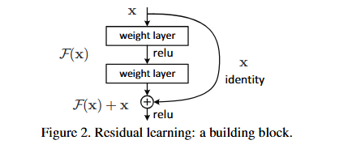
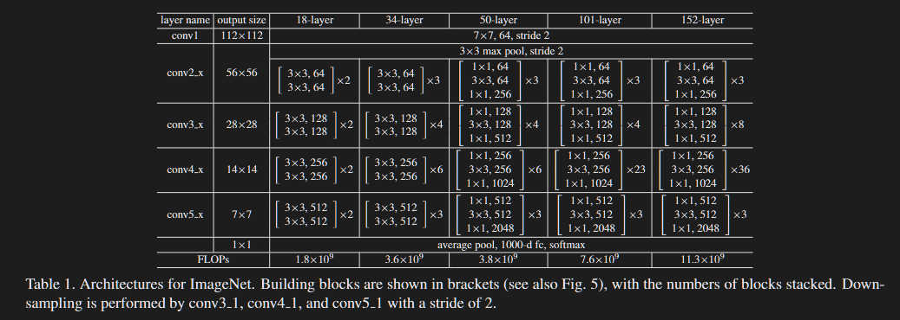
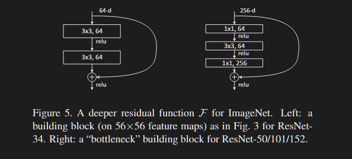

# ResNets

## Introduction

Recent Evidence: Depth == Performance

### Better Network == Stack More Layers?

- Big Issue: **Vanishing/Exploding** Gradients
  - Majorly solved by normalized initialization and intermediate normalization layers (helps in convergence of deep nets with SGD)
- But when deep nets are able to start converging, another issue exposed: **DEGRADATION**
  - Increasing network depth, accuracy gets saturated and then degrades rapidly.
  - This degradation, not a cause of overfitting as adding more layers leads to higher training error
  - This indicated that not all systems are similarly easy to optimize.
- **Possible Solution to Degradation?**

Consider a shallow architecture and deeper counterpart

Solution is by constructing the deeper model by adding layers that are **identity mapping** and other layers are copied from the learned shallower model.

Expected: Deeper model should not have higher train error as comparison to shallower model

Actual: Current solvers unable to find solution that are comparably as good or better than the constructed solution or do so in feasible time

### Deep Residual Learning Framework

Instead of hoping each few stacked layers directly fit a desired underlying mapping, **WE EXPLICITLY LET THESE LAYERS FIT A RESIDUAL MAPPING**

Formally,

- Let the desired underlying mapping be: $\mathcal{H}(x)$
- We let the stacked nonlinear layers fit another mapping: $\mathcal{F}(x) = \mathcal{H}(x) - x$
- Can be recasted to: $\mathcal{H}(x) = \mathcal{F}(x) + x$

Hypothesis: It is easier to optimize the residual mapping than the original unreferenced mapping.

> If an identity mapping were optimal, it would be easier to push the residual to zero than to fit an identity mapping by stack of non linear layers

Formulation of $\mathcal{F}(x) + x$ can be realized by feedforward networks with **shortcut connections**

- Shortcut connections are those skipping one or more layers
- In this case, shortcut connection simply perform identity mapping and their outputs are added to the outputs of stacker layers
- These connections neither add extra computation nor extra complexity as network can still be trained by SGD with backpropagation.

Results show:

- Deep Residual Nets are easy to optimize but counterpart plain nets (simple stacking) exhibit higher training error
- Deep Residual Nets can easily enjoy accuracy gains from greatly increased depths, producing results substantially better than previous networks

## Related Work

### Residual Representations:

1. In image recognition, **VLAD** is a representation that encodes by the residual vectors with respect to a dictionary
2. Fischer vector can be formulated as probabilistic version of VLAD.

Both are powerful shallow representations for image retrieval and classification.

Simple Terms:

- VLAD and Fischer don't store raw features
- Instead, they store difference (residual) from some reference (dictionary/mean)
- Residuals focus on **what’s missing / what needs correction**, not the full signal.

In low-level vision and computer graphics:

- For solving Partial Differential Equations, the widely used Multigrid method reformulates the system as subproblems at multiple scales where each subproblem is responsible for residual solution between a coarser and finer scale.
  - Simply, Complex problems are solved at multiple scales and Each level solves a **residual error** from the previous level
  - Instead of solving everything at once:
    - Solve coarse version
    - Then fix the **remaining error (residual)** step by step

It has been shown that hese solvers converge much faster than standard solvers that are unaware of the residual nature of the solutions. 

**Optimization becomes easier when the model focuses on error correction, not full reconstruction.**

### Shortcut Connections

- Early Practice of training MLP: 
  - Add a linear layer connected from network input to output
  - A few intermediate layers are directly connected to auxiliary classifiers for addressing vanishing/exploding gradients.
- Highway Networks present shortcut connections with gating functions
  - These gates are data-dependent and have parameters, in contrast to our identity shortcuts that are parameter-free.
  - When gate shortcut is closed (approaching zero), the layers in highway networks represent non-residual functions
- On contrary, our formulation always learns residual functions; our identity shortcuts are never closed, and all information is always passed through, with additional residual functions to be learned. 

## Deep Residual Learning

### Residual Learning

Consider $\mathcal{H}(x)$ as an underlying mapping to be fit by a few stacked layers (not necessarily entire net) with $x$ denoting inputs to the first of these layers.

If Universal Approximation Theorem is TRUE, then it is equivalent to hypothesize that multiple non linear layers can asymptotically approximate the residual functions i.e. $\mathcal{H}(x) - x$ (assuming input and output are of same dimensions)

Instead of expecting stacked layers to approximate $\mathcal{H}(x)$, we explicitly let these layers approximate a residual function

$\mathcal{F}(x) := \mathcal{H}(x) - x$.

The original function thus becomes $\mathcal{F}(x) + x$.

This reformulation is motivated by the counterintuitive phenomena about degradation problem.

> If added layers can be constructed as identity mapping, a deeper model should have training error no greater than it's shallowe counterpart

This degradation problem suggests solvers might have difficulties in approximating identity mappings by multiple nonlinear layers

With residual learning formulation, if identity mapping is optimal, the solvers may simply drive the weights of multiple nonlinear layers towards zero to approach identity mappings

In practice, identity mappings are unlikely to be optimal, but our reformulation may help precondition the problem.

> If the optimal function is closer to an identity mapping than to a zero mapping, it should be easier for the solver to find the perturbations with reference to an identity mapping, than to learn the function as a new one.

### Identity Mapping by Shortcuts

We adopt residual learning to a every few stacked layers

$$

y = \mathcal{F}(x, \{ W_i \}) + x

$$

- x: input vector
- y: output vector
- $ \mathcal{F}(x, \{ W_i \})$: residual mapping to be learned

In a 2 layer setup as shown above,

- $\mathcal{F} = W_2 \sigma (W_1 \, x)$ 
- $\sigma$ is ReLU
- biases omitted for simplicity

The operation $\mathcal{F} + x$ is performed by a shortcut connection and element-wise addition.

> Second Non Linearity is applied after the ADDITION

As visible, the shortcut connections neither add more parameters nor extra computational complexity.

For above case, dimensions of $\mathcal{F}$ and $x$ must be same.

Otherwise we need to perform linear projection on $x$ to make it compatible

$$

y = \mathcal{F} (x, \{ W_i \}) + W_s x \, \, \, \, \, \, \, \, \, \, \, (2)

$$

- We can use square matrix in Eqn (1) but shown by experiments that identity mapping is sufficient and economical, thus $W_s$ only used when matching dimensions.

Form of residual function $\mathcal{F}$ is flexible

- We use 2-3 layers, but more also possible
- If used with single layer, it is similar to linear layer: $y = W_1 x + x$, but for this, there are no observed advantages.

> All notations above are regarding fully connected layers, BUT THEY ARE STILL APPLICABLE TO CONVOLUTIONAL LAYERS

The function $\mathcal{F}(x, \{ W_i \} )$ can represent multiple convolutional layers.

- Element wise addition is performed on 2 feature maps, channel by channel.

### Network Architectures

#### Plain Network

- Inspired by philosophy of VGGNet.
- Mostly $3 \times 3$ filters

2 simple design principles:

- For the same output feature map size, the layers have same number of filters.
- If feature map size is halved, number of filters is **doubled** so as to preserve the time complexity per layer

Down sampling performed directly by using convolutional layers that have stride of 2.

Network ends with Global Average Pooling and a 1000-way fully connected layer with softmax.

- Total Layers: 34

> This model has fewer filters and LOWER complexity than VGG nets
>
> - 3.6 billion FLOPs (multiply-adds)
> - This is only 18% of VGGNet-19 (19.6 billion FLOPs

#### Residual Network

Same plain network used, but shortcut connections are inserted.

- Identity mapping can be performed directly when input output dimensions match.

When dimensions increase (change), 2 options considered:

- Shortcut still performs identity mapping, extra zero entries padded for increasing dimensions. (No extra parameters here)
- Projection shortcut in Eqn (2) is used to match dimensions (done using $1 \times 1$ convolutions)

> For both options, when shortcuts go across feature maps of 2 sizes, they are performed with a stride of 2

### Implementation

- Image resized with its shorter side randomly sampled in [256, 480].
- $224 \times 224$ crop is randomly sampled from an image or its horizontal flip
- Per-Pixel mean subtracted.
- Standard color augmentation used.

**Batch Normalization** applied after each convolution and before activation.

**SGD** used with mini-batch size of 256, LR = 0.1 and divided by 10 when error plateaus

Weight decay of  0.0001 and momentum of 0.9 applied.

Dropout not used.

- Standard 10-crop testing
- Scores averaged at multiple scales.

## Experiments

### ImageNet

#### Plain Networks

- Deeper 34-layer plain net has higher validation error than shallower 18-layer plain net.
  - Why? ==> **DEGRADATION PROBLEM**
    - 34 layer plain net has higher training error throughout the training procedure even though the solution space of the 18 layer is a subspace of that of the 34-layer one
    - Optimization difficulty is unlikely due to vanishing gradients as they are trained with Batch Normalization.
  - 34-layer net still gets competitive accuracy suggesting solver works to an extent
- Deep plain nets may have exponentially low convergence rates which impact the reducing of training error

#### Residual Networks

Same architectures as plain nets, except the shortcut connection is added to each pair of $3 \times 3$ filters.

- Identity mapping and Padding zeros are used for connections, thus no extra parameters.

3 Major observations:

- 34-layer ResNet is better than 18-layer ResNet, and also exhibits considerably lower training error and is more generalizable to validation data ==> **DEGRADATION problem addressed and managed**
- Compared to plain counterpart, 34-layer ResNet reduces top-1 error by 3.5%, resulting from successfully reduced training error
- 18-layer plain and residual nets are comparably accurate but resnet converges faster.

#### Identity vs Projection Shortcuts

3 options compared

(A) Zero padding shortcut for increasing dimensions (no parameter added)

(B) Projection shortcut used for increasing dimensions and other shortcuts are identity

(C) All shortcuts are projections.

Results show:

- All are better than plain counterpart
- B is slightly better than A (because zeros in A have no residual learning)
- C is marginally better than B (due to extra parameters induced)

> This small difference indicates that projection shortcuts are not essential for addressing the degradation problem

#### Deeper Bottleneck Architectures

- Used stack of 3 layers instead of 2 for residual function
  - 3 layers are $1 \times 1$, $3 \times 3$, $1 \times 1$
  - $1 \times 1$ are responsible for reducing and restoring dimensions, leaving the $3 \times 3$ layer a bottleneck with smaller I/O dimensions
- Identity shortcut important, if replaced with projection, it is shown that time complexity and model size is doubled

#### 50-layer ResNet

- Each 2-layer block replaced with 3-layer bottleneck block, resulting in 50 layer ResNet
- 3.8 billion FLOPs

#### 101-layer and 152-layer ResNets

- More 3-layer blocks used
- 152-layer (11.3 billion FLOPs) is still less complexity than VGG nets (15 billion+ FLOPs)