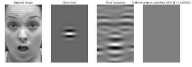

### Gabor Filter

Localized pattern that looks like a sinusoidal grating (light/dark stripes), multiplied by gaussian window (localized in space)

As visible, it is basically a edge/bar detector with specific orientation and a specific spatial frequency (scale).

In image terms, A gabor filter corresponds strongly to:
- edges
- oriented textures
- repeated local structure.

These are first order statistics of natural images: 
- natural images have strong local correlations
- energy concatenates along edges and contours
- fourier energy is not uniform

#### Primate Visual Cortex?

In primate visual cortex,
- Neurons respond to specific orientations
- at specific spatial frequencies
- within localized receptive fields

A Gabor filter is a mathematical caricature of that response.

These filters were measures and not learned, there was a heavy inductive bias regarding what early vision should extract (edges, simple lines, corners, etc).

#### Why a series?

A single gabor filter only sees one scale.

But natural images contain multiple scales simultaneously:
- fine edges (eyelashes, grass blades)
- medium textures (fur, wool)
- coarse boundaries (object silhouttes)

Thus we used filter bank ==> multiple orientations, multiple sizes, applied in parallel

> Scale is not hierarchical by default — it is concurrent.

#### Why Fixed?

Fixed gabor filters assumed
- statistics of natural images are known and universal
- Early visual features should be hand-designed
- Learning should happen after edge extraction

This was a tradeoff b/w (flexibility vs stability) & (adaptability vs interpretability)

So fixing filters was seen as protective, not limiting. (as limited data, compute)

**Limitation of Fixed Filters**

Fixed Gabor filters
- cannot adapt to dataset-specific statistics
- cannot learn non-edge primitives
- assume linear separability of early features

They discard info by construction:
- phase relationships outside the filter bank
- non-sinusoidal local patterns
- compositional features

This becomes a bottleneck once data grows.

#### Relevance to GoogLeNet?

GoogLeNet does not say "Lets use Gabor Filters"

It says: "The idea behind Gabor banks was right — but fixing them was wrong."

It keeps: parallel multi-scale processing, locality and orientation-agnostic early processing.

It rejects: fixed filters, hand designed bases, single-scale assumptions per layer.

**Inception Modules are thus: learned filter banks, operating at multiple spatial extents, selected data-adaptively**

To summarize: GoogLeNet is loosening, not removing, the bias.